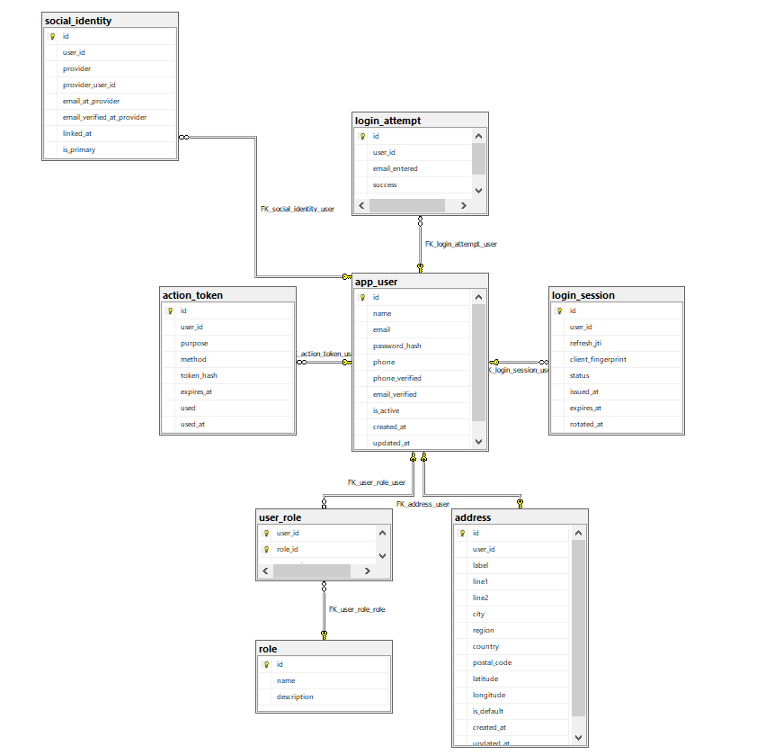
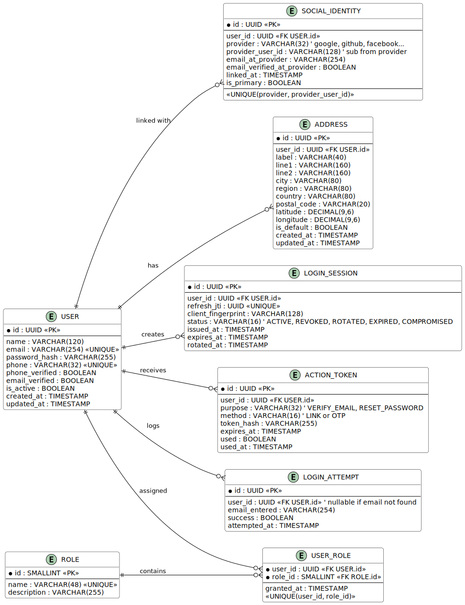

# 📦 Authentication Module Schema

This document describes the database schema used for **Javeats Lite** authentication and authorization.  
It covers the purpose of each table and highlights important **edge cases** to consider.

---

---

## 📑 Table Descriptions

### 1. USER
Core table representing a system account.  
- Stores personal information: `name`, `email`, `phone`.  
- Security fields: `password_hash`, verification flags (`email_verified`, `phone_verified`), `is_active`.  
- `email` and `phone` are **unique**.  
- Audit fields: `created_at`, `updated_at`.

---

### 2. ADDRESS
Stores user addresses.  
- A user may have multiple addresses.  
- Fields include `label` (e.g., "Home", "Work"), `city`, `country`, optional geolocation (`latitude`, `longitude`).  
- `is_default` marks the primary delivery address.  
- Audit fields: `created_at`, `updated_at`.

---

### 3. ROLE
Defines available system roles.  
- Examples: `ADMIN`, `CUSTOMER`, `MERCHANT`, `DRIVER`.  
- Each role has a unique `name` and optional `description`.

---

### 4. USER_ROLE
Join table for many-to-many relation between **USER** and **ROLE**.  
- Each row means "user X has role Y".  
- Allows multiple roles per user.  
- Includes `granted_at` to track when the role was assigned.  
- Unique constraint on `(user_id, role_id)` prevents duplicates.

---

### 5. LOGIN_SESSION
Tracks active user sessions.  
- Holds the `refresh_jti` (unique ID of the refresh token).  
- `status` lifecycle: `ACTIVE`, `REVOKED`, `ROTATED`, `EXPIRED`, `COMPROMISED`.  
- Supports **secure JWT access + refresh** flows.  
- Enables logout from one device or all devices.  
- Timestamps: `issued_at`, `expires_at`, `rotated_at`.

---

### 6. ACTION_TOKEN
Temporary tokens for specific user actions.  
- `purpose`: `VERIFY_EMAIL`, `RESET_PASSWORD`, etc.  
- `method`: `LINK` (email verification link) or `OTP` (numeric code).  
- Includes `token_hash`, `expires_at`, `used` flag, and `used_at`.  
- One-time use: must be marked `used=true` after success.

---

### 7. LOGIN_ATTEMPT
Logs login attempts for auditing and security.  
- Fields: `email_entered`, `success` flag, `attempted_at`.  
- `user_id` may be null if no account exists for the attempted email.  
- Supports rate limiting, brute-force detection, and account lockouts.

---

### 8. SOCIAL_IDENTITY
Links a **USER** to an external identity provider (Google, GitHub, Facebook, Apple).  
- Fields: `provider`, `provider_user_id` (unique per provider).  
- `email_at_provider` and `email_verified_at_provider` mirror provider data.  
- `linked_at` records when the account was connected.  
- `is_primary` marks the main social account if multiple are linked.  
- Enforces uniqueness so one social account cannot link to multiple users.

---

## ⚠️ Edge Cases & Considerations

1. **Duplicate Emails**
   - Signup with an email already in `USER` should fail.  
   - Social login with an existing email → auto-link if `email_verified=true`, otherwise require manual verification.

2. **Passwordless Accounts**
   - Social-only accounts may not have a `password_hash`.  
   - Application logic must handle this safely.

3. **Multiple Addresses**
   - Enforce only one `is_default=true` per user.  
   - Update rules when a new default is added.

4. **Session Security**
   - Rotate refresh tokens on every use.  
   - Revoke sessions if compromise is suspected.  
   - `Logout All` should mark all sessions as `REVOKED`.

5. **Action Tokens**
   - Expire quickly (e.g., 30 minutes).  
   - One-time use only.  
   - Rate-limit resends to prevent spam.

6. **Login Attempts**
   - Track failed attempts for brute-force protection.  
   - Lock accounts after N failed attempts within a time window.

7. **Social Identity**
   - If provider returns **no email**, user must manually provide one.  
   - If `email_verified_at_provider=false`, treat the email as unverified and send your own verification.  
   - Prevent `(provider, provider_user_id)` from being linked to multiple users.

---

## 📘 Summary
This schema is designed to support:
- Traditional signup/login with email and password.  
- Strong account security (sessions, rotation, action tokens, login attempts).  
- Flexible social login/signup flows with auto-linking.  
- Role-based access control.  
- Multi-address management for delivery apps.

