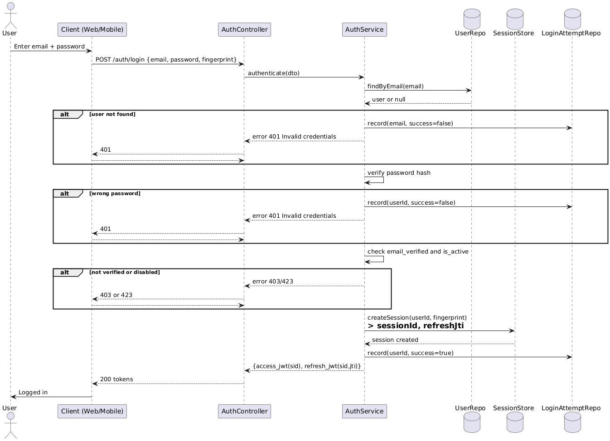
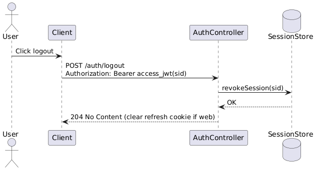
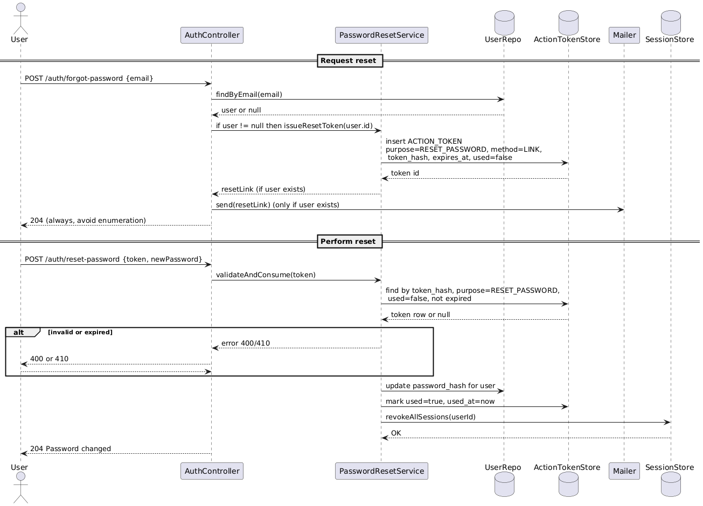
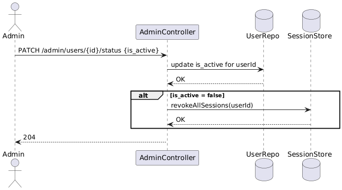
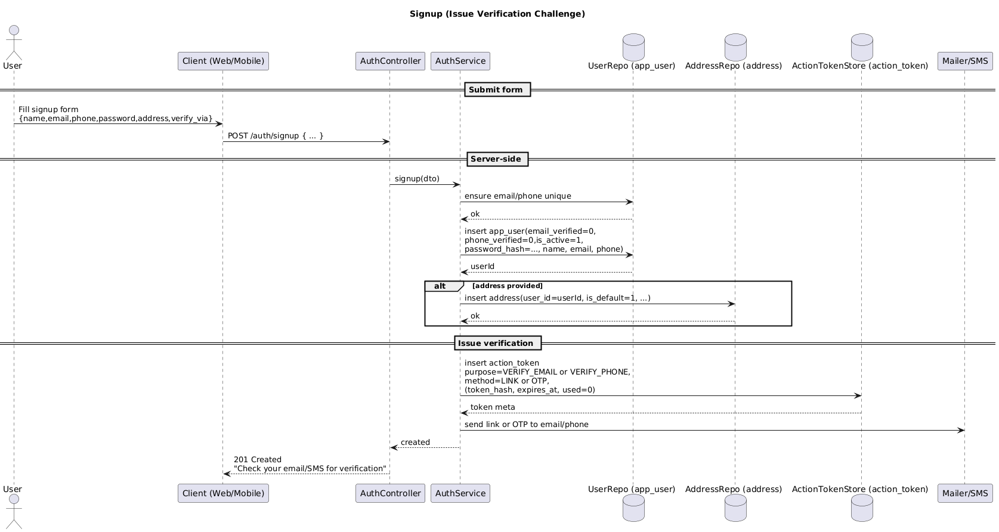
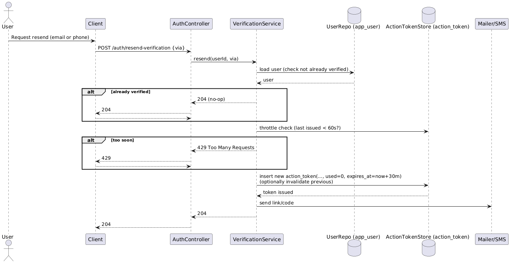
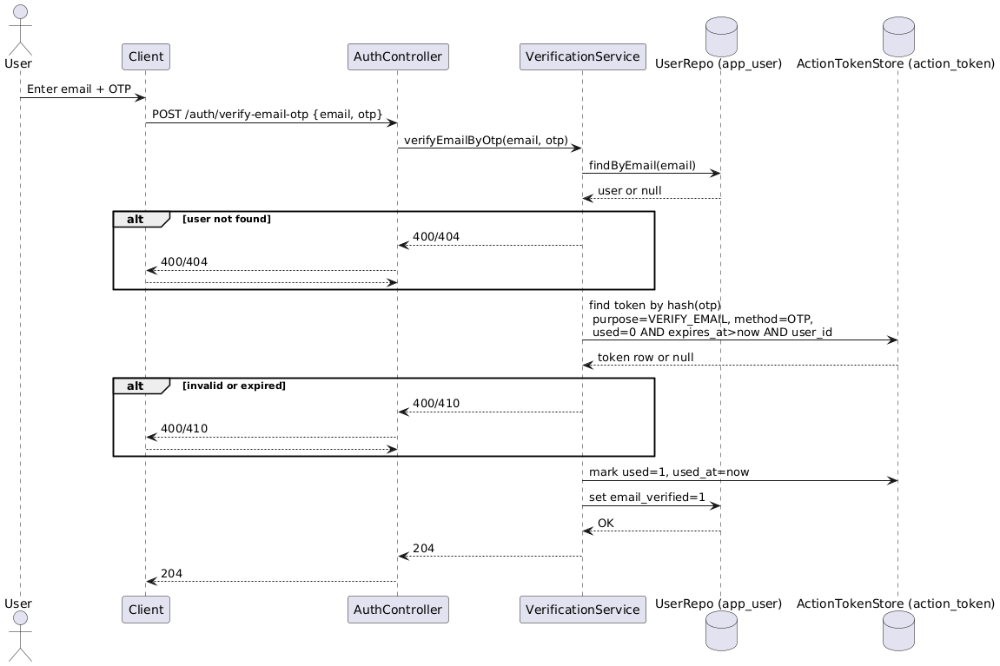
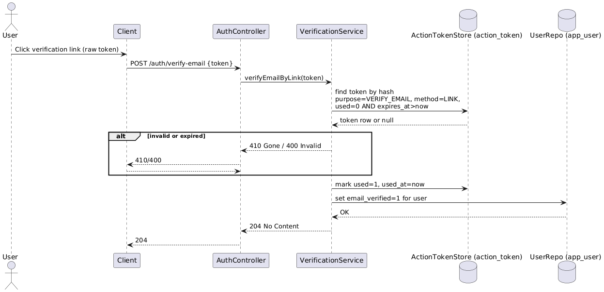
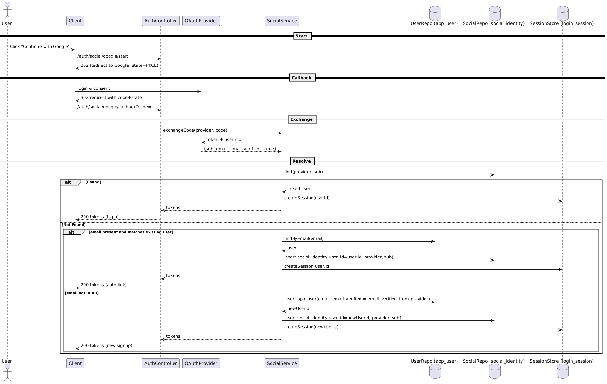
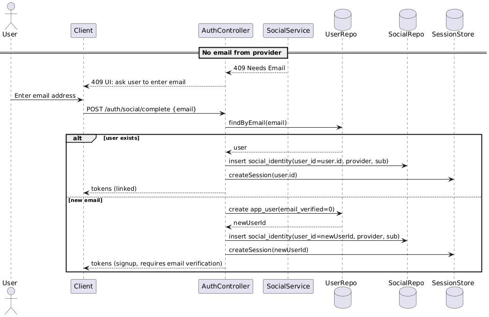

# 🔄 Authentication Module – Sequence Diagrams

This document describes the main authentication flows with sequence diagrams, goals, actors, and key considerations.

---

## 1) Login (email + password)

**Title:** User Login with Email and Password  

**Goal:** Authenticate user and issue access/refresh tokens.  

**Actors:** User, Client, AuthController, AuthService, UserRepo, SessionStore, LoginAttemptRepo  

**Preconditions:**
- User exists and `is_active = true`.  
- Password stored as hash.  

**Main Flow:**
1. Client sends email + password.  
2. Server finds user by email.  
3. Compare password hash.  
4. Create new login_session.  
5. Return access + refresh tokens.  

**Alternative Flows / Errors:**
- Email not found or wrong password → 401.  
- Account inactive → 403.  

**Data Touchpoints:**
- `USER`, `LOGIN_SESSION`, `LOGIN_ATTEMPT`.  

**Security Checks:**
- Hash verification.  
- Rate limiting.  

**Idempotency & Concurrency:**
- Multiple sessions can exist.  

**Postconditions:**
- Valid session created.  

**NFR Notes:**
- Typical response <200ms.  

---

## 2) Logout (single device session)

**Title:** Logout from one session  

**Goal:** Revoke refresh token for current device.  

**Actors:** User, Client, AuthController, SessionStore  

**Preconditions:**
- Valid access token with `sid`.  

**Main Flow:**
1. Client calls logout.  
2. Server updates login_session to REVOKED.  
3. Return 204.  

**Alternative Flows / Errors:**
- Session not found → still 204 (idempotent).  

**Data Touchpoints:**
- `LOGIN_SESSION`.  

**Security Checks:**
- Verify access token.  

**Idempotency & Concurrency:**
- Repeated calls no side effect.  

**Postconditions:**
- Session revoked.  

---

## 3) Forgot Password & Reset Password

**Title:** Forgot and Reset Password  

**Goal:** Let user reset password securely.  

**Actors:** User, AuthController, ActionTokenStore, UserRepo, SessionStore, Mailer  

**Preconditions:**
- User exists.  

**Main Flow:**
1. Forgot: issue ACTION_TOKEN purpose=RESET_PASSWORD.  
2. Send email with link/OTP.  
3. Reset: verify token, update password_hash.  
4. Revoke old sessions.  

**Alternative Flows / Errors:**
- Token invalid/expired → 400/410.  

**Data Touchpoints:**
- `ACTION_TOKEN`, `USER`, `LOGIN_SESSION`.  

**Security Checks:**
- Short expiry, one-time use.  

**Idempotency & Concurrency:**
- Multiple reset attempts only first succeeds.  

**Postconditions:**
- Password updated.  

---

## 4) Enable or Disable Account (admin action)

**Title:** Enable/Disable account  

**Goal:** Admin manages account status.  

**Actors:** Admin, AdminController, UserRepo, SessionStore  

**Preconditions:**
- Admin has required role.  

**Main Flow:**
1. Admin updates `is_active`.  
2. If disabled, revoke all sessions.  

**Alternative Flows / Errors:**
- User not found → 404.  

**Data Touchpoints:**
- `USER`, `LOGIN_SESSION`.  

**Security Checks:**
- Role check, audit logs.  

**Idempotency & Concurrency:**
- Repeated disable has no effect.  

**Postconditions:**
- Account active/inactive.  

---

## 5) Sign-up (email + password, optional address)

**Title:** User Registration  

**Goal:** Create user, optional address, issue verification token.  

**Actors:** User, Client, AuthController, UserRepo, AddressRepo, ActionTokenStore  

**Preconditions:**
- Email and phone unique.  

**Main Flow:**
1. Client submits signup info.  
2. Insert USER (hashed password).  
3. Optional: insert ADDRESS.  
4. Issue VERIFY_EMAIL token.  

**Alternative Flows / Errors:**
- Duplicate email/phone → 409.  

**Data Touchpoints:**
- `USER`, `ADDRESS`, `ACTION_TOKEN`.  

**Security Checks:**
- Password complexity.  

**Idempotency & Concurrency:**
- Multiple requests blocked by unique constraint.  

**Postconditions:**
- User created, awaiting email verification.  

---

## 6) Resend Verification

**Title:** Resend email verification  

**Goal:** Issue new verification token.  

**Actors:** User, AuthController, ActionTokenStore, Mailer  

**Preconditions:**
- User exists, not yet verified.  

**Main Flow:**
1. Client requests resend.  
2. Server issues new VERIFY_EMAIL token.  
3. Send email.  

**Alternative Flows / Errors:**
- Too many requests → 429.  

**Data Touchpoints:**
- `ACTION_TOKEN`.  

**Security Checks:**
- Rate limiting.  

**Idempotency & Concurrency:**
- Latest token is the only valid one.  

**Postconditions:**
- Email sent.  

---

## 7) Verify Email via OTP

**Title:** Verify email (OTP)  

**Goal:** Confirm user’s email using numeric OTP.  

**Actors:** User, AuthController, ActionTokenStore, UserRepo  

**Preconditions:**
- Valid unexpired token.  

**Main Flow:**
1. Client submits OTP.  
2. Server verifies ACTION_TOKEN.  
3. Mark token used, set email_verified=1.  

**Alternative Flows / Errors:**
- Invalid OTP → 400.  

**Data Touchpoints:**
- `ACTION_TOKEN`, `USER`.  

**Security Checks:**
- One-time use, expiry check.  

**Postconditions:**
- Email verified.  

---

## 8) Verify Email via Link

**Title:** Verify email (Link)  

**Goal:** Confirm user’s email through unique link.  

**Actors:** User, AuthController, ActionTokenStore, UserRepo  

**Preconditions:**
- Token in link is valid.  

**Main Flow:**
1. User clicks link.  
2. Server verifies ACTION_TOKEN.  
3. Mark used, set email_verified=1.  

**Alternative Flows / Errors:**
- Token expired → 410.  

**Data Touchpoints:**
- `ACTION_TOKEN`, `USER`.  

**Security Checks:**
- Signed token, expiry.  

**Postconditions:**
- Email verified.  

---

## 9) Social login/signup (auto-link by email)

**Title:** Social login/signup (auto-link)  

**Goal:** Login or create user via provider account.  

**Actors:** User, Client, AuthController, OAuthProvider, SocialService, UserRepo, SocialRepo, SessionStore  

**Preconditions:**
- Provider returns verified email.  

**Main Flow:**
1. User authenticates with provider.  
2. Server exchanges code → gets profile.  
3. If (provider, sub) exists → login.  
4. Else if email matches existing → auto-link.  
5. Else create new user and link.  
6. Issue tokens.  

**Alternative Flows / Errors:**
- Invalid provider response → 400.  

**Data Touchpoints:**
- `SOCIAL_IDENTITY`, `USER`, `LOGIN_SESSION`.  

**Security Checks:**
- Validate id_token.  

**Postconditions:**
- Active session created.  

---

## 10) Social login/signup (no email → ask user)

**Title:** Social login/signup (no email)  

**Goal:** Handle provider accounts with no email.  

**Actors:** User, Client, AuthController, OAuthProvider, SocialService, UserRepo, SocialRepo, SessionStore  

**Preconditions:**
- Provider returns no email.  

**Main Flow:**
1. User authenticates with provider.  
2. Provider returns profile without email.  
3. Server responds 409 → client asks user for email.  
4. If email exists → link.  
5. Else create new user.  
6. Issue tokens.  

**Alternative Flows / Errors:**
- Invalid email → 400.  

**Data Touchpoints:**
- `SOCIAL_IDENTITY`, `USER`, `LOGIN_SESSION`.  

**Security Checks:**
- Email verification step required.  

**Postconditions:**
- Active session created.  

